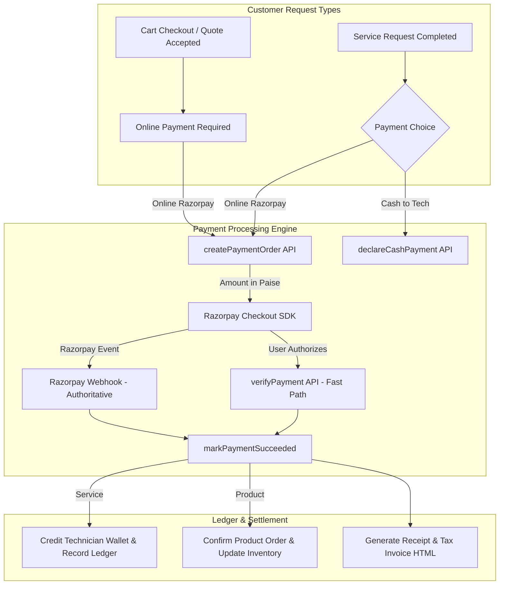
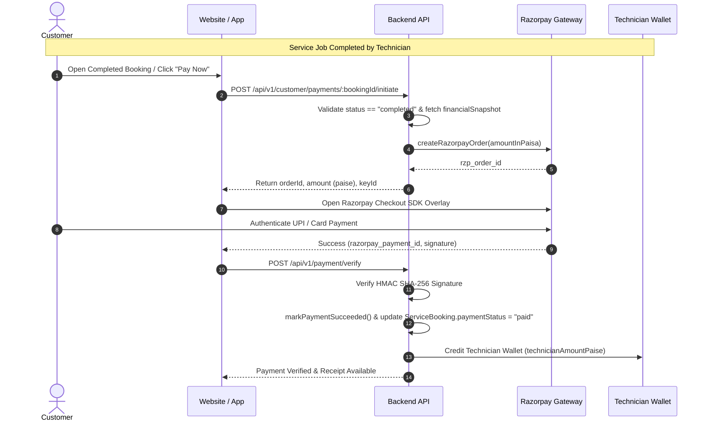
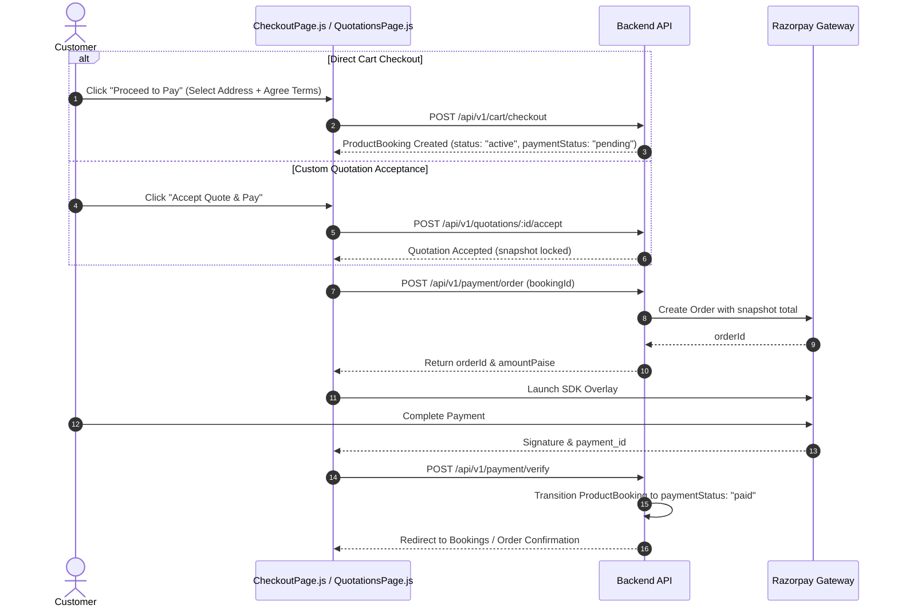

# RightTouch Customer Payment Engine: Service vs Product Payment Documentation

## Executive Summary

The **RightTouch Payment Engine** provides an enterprise-grade, secure, multi-tier financial processing system supporting both **Doorstep Service Bookings** and **Product E-Commerce / Custom Quotation Orders**. 

The platform guarantees strict financial integrity, idempotency, server-calculated pricing snapshots, automated tax/commission splits, Razorpay gateway integration, cash/COD workflows, automated receipts, and instant refund processing.

This document details the complete end-to-end architecture, technical workflows, schema design, state machines, and payment operations for both **Services** and **Products**.

---

## 1. Comparative Analysis: Service Payments vs. Product Payments

| Dimension | Service Payments (Doorstep Services) | Product Payments (E-Commerce & Custom Quotes) |
| :--- | :--- | :--- |
| **Payment Timing** | **Post-Service Completion** (Pay-at-Completion flow). Payment is locked until technician completes service (`status === "completed"`). | **Pre-Fulfillment / At Checkout**. Customer pays when placing cart order or accepting custom quotation. |
| **Financial Split Engine** | Includes Base Amount, GST Tax, Optional Tip, **Technician Payout Share**, and **Platform Admin Commission**. | Base Amount, GST Tax (5%), Shipping/Installation fees. No technician commission split at checkout. |
| **Supported Modes** | Razorpay Online (UPI/Card/Netbanking), Cash to Technician (`declareCashPayment`), Free (₹0 promo). | Razorpay Online Checkout (UPI/Card/Netbanking), Cash on Delivery (COD). |
| **Payment Trigger Point** | Customer triggers from `PaymentsPage` or `BookingDetailPage` after technician marks service completed. | Triggered automatically during cart checkout (`CheckoutPage.js`) or quote acceptance (`QuotationsPage.js`). |
| **Earnings Settlement** | Automatically credits Technician Wallet balance upon payment verification/webhook capture. | Settles platform earnings and product inventory ledger upon payment verification. |
| **Cancellation & Refund Policy** | Cancellation before completion has 0 charge. Post-completion refund calculated based on policy rules. | Cancelable prior to `ready_for_delivery` / `out_for_delivery`. Triggers automated Razorpay refund engine. |

---

## 2. System Architecture & High-Level Workflow



---

## 3. Core Domain Models & Schemas

### 3.1 `Payment` Schema (`Schemas/Payment.js`)
The `Payment` record is created as a **pure snapshot copy** of the booking's financial fields (`financialSnapshot`). It never recomputes values on the fly.

- `bookingId`: Reference to `ServiceBooking` or `ProductBooking` or `Quotation`.
- `itemType`: `"service"` | `"product"` | `"quotation"`.
- `status`: `"pending"` | `"success"` | `"failed"` | `"refunded"` | `"manual_review"`.
- `totalAmountPaise` & `totalAmount`: Total money collected.
- `baseAmountPaise`, `gstAmountPaise`, `tipAmountPaise`.
- `commissionAmountPaise` & `technicianAmountPaise` (for services).
- `provider`: `"razorpay"` | `"cash"` | `"free"`.
- `providerOrderId` & `providerPaymentId`: Razorpay transaction references.

### 3.2 `PaymentAttempt` Schema (`Schemas/PaymentAttempt.js`)
Tracks each individual payment attempt for in-flight protection and idempotency.

- `paymentId`, `bookingId`, `customerId`.
- `idempotencyKey`: Unique header key ensuring duplicate requests do not create double charges.
- `state`: `"created"` | `"authorized"` | `"captured"` | `"failed"` | `"expired"`.
- `expiresAt`: TTL lock window (typically 15-30 minutes).

### 3.3 `Receipt` Schema (`Schemas/Receipt.js`)
Generates formal compliance tax invoices upon successful payment capture.

- `receiptNumber`: Sequential invoice number (e.g. `INV-2026-0892`).
- `invoiceHtml`: Full styled invoice HTML ready for PDF export or download.
- `invoiceUrl`: Optional CDN link.

---

## 4. Detailed Customer Payment Workflows

### 4.1 Flow 1: Service Payment Workflow (Pay-at-Completion)



1. **Gate Check**: Customer attempts payment on a `ServiceBooking`. Backend verifies `status === "completed"`.
2. **Order Creation**: Backend reads `financialSnapshot` (paise) and creates a Razorpay order.
3. **Attempt Lock**: A `PaymentAttempt` is recorded in `created` state with an idempotency key.
4. **Payment Execution**: Customer pays via Razorpay modal in the browser or mobile app.
5. **Verification & Settlement**: Signature verified via HMAC-SHA256 (`order_id|payment_id`). Payment transitions to `success`. Technician wallet is automatically credited with their share.

---

### 4.2 Flow 2: Product Payment Workflow (Direct Checkout & Custom Quotes)



1. **Order Initiation**:
   - **Cart Route**: `checkout()` creates a `ProductBooking` document with a locked snapshot.
   - **Quote Route**: `acceptQuotation()` converts accepted quote snapshot into a `ProductBooking`.
2. **Payment Order**: Calls `createPaymentOrder()` to obtain `providerOrderId`.
3. **SDK Processing**: Amount is sent in **Paise** directly to `window.Razorpay()`.
4. **Verification**: Fast-path verification updates `ProductBooking.paymentStatus = "paid"`. Authoritative webhook confirms capture if browser drops connection.

---

### 4.3 Flow 3: Cash & Cash on Delivery (COD) Workflows

- **Service Cash Payment (`declareCashPayment`)**:
  - Customer declares cash payment to technician upon job completion.
  - Backend creates a `PaymentAttempt` with method `"cash"` and state `"authorized"`.
  - Payment state remains `cash_due` until the technician confirms cash collection on their app.
- **Product Cash on Delivery (COD)**:
  - Customer chooses COD during checkout.
  - `ProductBooking` is created with `paymentMode: "cod"` and `paymentStatus: "pending"`.
  - Payment transitions to `"paid"` when delivery partner/technician collects cash at doorstep and verifies delivery.

---

### 4.4 Flow 4: Free ₹0 Bookings

- For promotional or ₹0 warranty bookings (`snapshotTotalPaise === 0`):
  - Razorpay order creation is **bypassed completely**.
  - Backend creates a `Payment` record with `provider: "free"`.
  - Instantly executes `markPaymentSucceeded()`.
  - Booking is updated to `paymentStatus: "paid"` with `paidAmount: 0`.

---

### 4.5 Flow 5: Payment Retries & Failure Handling

- If a payment fails (bank decline, timeout, canceled checkout):
  1. `Payment.status` transitions to `"failed"`.
  2. Failure reason logged (e.g. `"Bank Server Timeout"`).
  3. `PaymentsPage.js` shows a **"Retry Payment"** button.
  4. Customer clicks Retry $\rightarrow$ API verifies no active payment is in flight (`hasLiveAttempt`).
  5. System generates a fresh Razorpay order for the unpaid snapshot and opens the payment gateway.

---

### 4.6 Flow 6: Refunds & Cancellation Handling

- When an eligible paid booking is canceled:
  - `refundEngine.js` calculates gross amount, cancellation fees, and net refund.
  - Invokes Razorpay Refunds API (`payments/{id}/refund`).
  - Webhook handles `refund.processed` / `refund.failed` asynchronously.
  - System logs refund record and presents expected credit date to customer.

---

## 5. Razorpay Integration Engine & Webhook Security

### 5.1 Amount Handling Standard
> [!IMPORTANT]
> **Strict Paise Standard**: All backend financial API payloads return money in **PAISE** (`1 INR = 100 Paise`). The frontend Razorpay Checkout SDK consumes paise directly without floating-point conversion, preventing 100x mismatch errors.

### 5.2 Server HMAC Verification Formula

$$\text{HMAC-SHA256}(\text{razorpay\_order\_id} + "|" + \text{razorpay\_payment\_id}, \text{RAZORPAY\_KEY\_SECRET})$$

If computed hash equals `razorpay_signature`, verification succeeds.

### 5.3 Authoritative Webhook Deduplication
- Webhooks are received at `/api/v1/payments/razorpay/webhook`.
- Every incoming webhook event is stored in `PaymentEvent` collection indexed by `eventId`.
- MongoDB unique index prevents duplicate processing of identical webhooks (idempotent no-op on duplicate).

---

## 6. Financial Snapshot & Security Safeguards

1. **Snapshot Copying (Zero Runtime Recalculation)**:
   - When a booking is created, its price, GST, and splits are frozen into `financialSnapshot`.
   - `Payment` doc copies this snapshot verbatim. Prices are never recomputed during payment or settlement to prevent price fluctuation fraud.
2. **Snapshot Drift Guard**:
   - If a pre-existing draft payment has an amount mismatch with the booking snapshot during checkout:
     - If money was captured $\rightarrow$ flag status as `manual_review` and alert admin.
     - If money was NOT captured $\rightarrow$ automatically resync draft payment to booking snapshot.
3. **Admin Audit Logging**:
   - All manual payment status modifications require a mandatory reason and are permanently recorded in `AuditLog`.

---

## 7. Customer Read Model & UI State Mapping

The customer payment state (`customerState`) is derived dynamically in `customerPaymentController.js`:

```
                    ┌─────────────────────────┐
                    │      Booking Read       │
                    └────────────┬────────────┘
                                 │
                 ┌───────────────┴───────────────┐
                 ▼                               ▼
          Service Booking                 Product Booking
                 │                               │
        Status Completed?                 Checkout Done?
        ┌────────┴────────┐             ┌────────┴────────┐
        YES              NO             YES              NO
        │                 │             │                 │
   Check Payment     Not Payable     Check Payment    Not Payable
   ┌────┴────┐                       ┌────┴────┐
   Paid?   Unpaid?                   Paid?   Unpaid?
   │         │                       │         │
[PAID]    [DUE / CASH_DUE]        [PAID]     [DUE]
```

### Derived Customer States
- **`due`**: Online payment pending. Actionable "Pay Now" / "Initiate Payment" button active.
- **`cash_due`**: Cash payment declared; awaiting technician/delivery confirmation.
- **`processing`**: In manual review or payment in-flight lock.
- **`paid`**: Payment confirmed. Receipt download button active.
- **`failed`**: Last attempt failed. Retry button enabled.
- **`refunded`**: Order canceled and refund processed.

---

## 8. API Endpoint Reference Table

| Route Endpoint | Method | Role Guard | Controller Function | Description |
| :--- | :--- | :--- | :--- | :--- |
| `/api/v1/customer/payments` | `GET` | Customer | `listMyPayments` | Paginated payment history with derived states. |
| `/api/v1/customer/payments/summary` | `GET` | Customer | `getMyPaymentSummary` | Executive metrics (total spent, due count, refunds). |
| `/api/v1/customer/payments/:bookingId` | `GET` | Customer | `getMyPaymentDetail` | Full payment details, attempts, and refunds. |
| `/api/v1/customer/payments/:bookingId/initiate` | `POST` | Customer | `initiatePayment` | Initiates Razorpay order & registers attempt. |
| `/api/v1/customer/payments/:bookingId/retry` | `POST` | Customer | `retryMyPayment` | Safely re-issues order for failed/unpaid booking. |
| `/api/v1/customer/payments/:bookingId/declare-cash` | `POST` | Customer | `declareCashPayment` | Declares cash payment to technician. |
| `/api/v1/customer/payments/:bookingId/receipt` | `GET` | Customer | `getReceipt` | Fetches receipt number and styled HTML invoice. |
| `/api/v1/payment/order` | `POST` | Customer/Admin | `createPaymentOrder` | Generates Razorpay order ID (Services & Products). |
| `/api/v1/payment/verify` | `POST` | Customer/Admin | `verifyPayment` | Verifies Razorpay HMAC signature (Fast-path). |
| `/api/v1/payments/razorpay/webhook` | `POST` | System | `razorpayWebhook` | Authoritative Razorpay webhook handler. |

---
*Documentation generated for RightTouch Platform Architecture.*
