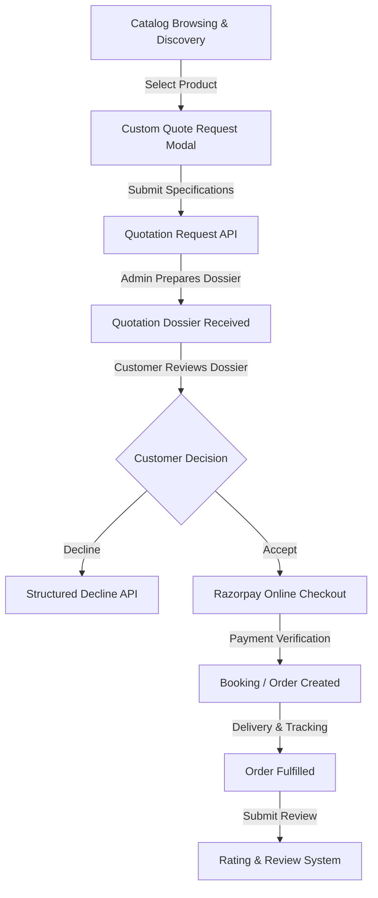
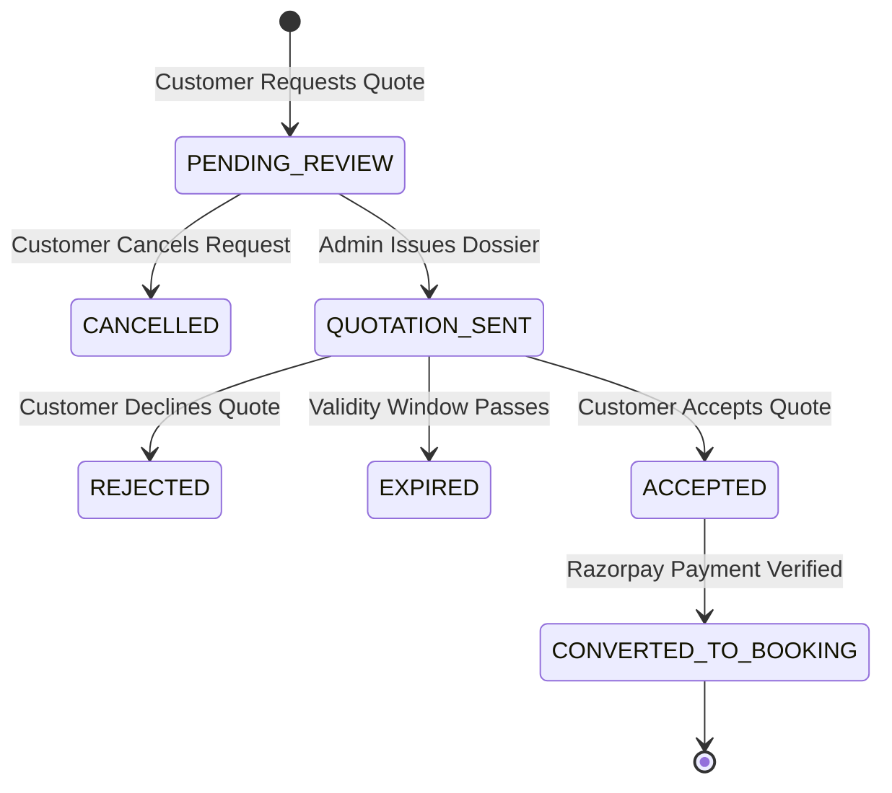

# RightTouch Customer Product Module: Architecture & Technical Documentation

## Executive Summary

The **RightTouch Customer Product Module** is an enterprise-grade e-commerce and custom service quotation engine integrated into the `RightTouchUserWebsite` platform (`/src`). Unlike standardized shopping carts, RightTouch caters to complex solar, electrical, inverter, security, and industrial equipment workflows requiring dynamic, site-specific pricing, custom quotes, formal administrative dossiers, Razorpay online checkout, real-time order delivery tracking, and verified post-fulfillment customer ratings.

This document provides a comprehensive A-to-Z breakdown of the frontend codebase in `RightTouchUserWebsite/src`, analyzing the user journey, service integration layer, state machines, financial tax engine, component mappings, and security safeguards.

---

## 1. Architectural Principles & System Strategy

### Core Design Principles
1. **Quote-First & Direct Buy Capability**: Supports both direct standard checkout and site-specific custom quote requests (`QuoteRequestModal`).
2. **Immutable Dossiers & Address Snapshots**: Once an admin issues a quotation and the customer accepts it, the delivery address and itemized price breakdown are snapshotted to guarantee financial immutability.
3. **Online-Only Razorpay Payment Policy**: Customer-facing workflows strictly support Razorpay digital checkout (cards, UPI, netbanking). Offline cash/bank transfers are restricted to admin-initiated reconciliation to prevent customer fraud.
4. **State Machine Auditability**: Rigorous, server-backed state transitions prevent double-payments, double-acceptances, or manipulation of expired quotes.
5. **Gated Ratings**: Product ratings and reviews are strictly gated to users with verified, delivered orders.

---

## 2. Full End-to-End User Journey & Lifecycle

### Step 1: Product & Category Discovery (`ProductPage.js`, `ProductDetailPage.js`)
- Customers browse products categorized into Solar Systems, Inverters & Batteries, Security/CCTV, and Commercial Installations.
- Live search filtering by product title, brand, or category.
- Product cards display average ratings, review counts, list price, discounted price, and percentage savings computed via `formatPriceSmart()`.

### Step 2: Custom Quotation Request (`QuoteRequestModal.js`)
- For items requiring custom installation, site inspection, or bulk scaling, customers submit a quote request containing:
  - Custom specifications / requirements text.
  - Delivery & installation address details.
  - Requested quantity and contact info.
- Creates a quotation entry in state `PENDING_REVIEW`.

### Step 3: Quotation Dossier Inspection & Action (`QuotationsPage.js`)
- Once the admin responds with an itemized quote, the customer receives a formal Dossier containing:
  - Base product pricing & custom line item additions.
  - Applied discounts & 5% GST tax calculation.
  - Expiry timestamp & custom terms.
- **Customer Actions**:
  - **Accept Quote**: Locks price, opens Razorpay online payment modal.
  - **Decline Quote**: Prompts for a structured decline reason (e.g., price too high, timeline delay) to assist admin analytics.
  - **Cancel Request**: Cancels pending requests prior to admin processing.

### Step 4: Razorpay Online Payment Settlement (`paymentService.js`)
- Invokes `paymentService.createOrder()` to generate an official Razorpay order ID.
- Launches the Razorpay checkout overlay.
- Upon successful payment authorization, calls `paymentService.verifyPayment()` with `razorpay_payment_id`, `razorpay_order_id`, and `razorpay_signature`.
- Transitions quotation to `CONVERTED_TO_BOOKING` and creates an active order.

### Step 5: Order Delivery & Status Tracking (`BookingsPage.js`, `BookingDetailPage.js`)
- Real-time status tracker monitoring order progression:
  `CONFIRMED` $\rightarrow$ `PROCESSING` $\rightarrow$ `SHIPPED` $\rightarrow$ `DELIVERED`.
- Displays technician/courier allocation details and estimated delivery windows.

### Step 6: Post-Fulfillment Rating & Review (`RatingsPage.js`)
- Customers rate delivered products from 1 to 5 stars with custom feedback text.
- Recalculates product rating summary dynamically upon submission.

---

## 3. Frontend Component & Page Registry

| Page / Component | File Location | Key Responsibilities |
| :--- | :--- | :--- |
| **Product Catalog** | `src/pages/ProductPage.js` | Grid view of product catalog, category navigation ribbons, quote modal trigger, search sync. |
| **Product Detail** | `src/pages/ProductDetailPage.js` | Single product deep-dive, image gallery slider, technical specs table, customer reviews list. |
| **Quote Modal** | `src/components/QuoteRequestModal.js` | Interactive pop-up form capturing custom requirement notes and delivery address for quote requests. |
| **Quotations Management** | `src/pages/QuotationsPage.js` | Dossier inspector, itemized tax breakdown display, accept/reject modals, Razorpay checkout trigger. |
| **Bookings & Orders** | `src/pages/BookingsPage.js` | Customer order history list, filterable by order status (`CONFIRMED`, `SHIPPED`, `DELIVERED`). |
| **Order Detail** | `src/pages/BookingDetailPage.js` | Delivery timeline visualizer, address snapshot display, invoice download trigger. |
| **Payments Ledger** | `src/pages/PaymentsPage.js` | Transaction history log showing Razorpay payment IDs, dates, amounts, and payment receipts. |
| **Ratings & Reviews** | `src/pages/RatingsPage.js` | Post-fulfillment feedback manager allowing customers to create, edit, or delete product reviews. |

---

## 4. Service Layer & API Integration Contracts

The frontend delegates all HTTP calls to modular service files wrapped with standardized headers, JWT auth tokens, and error handling.

### 4.1 Product Service (`src/services/productService.js`)
- `getProducts(params)` $\rightarrow$ `GET /api/v1/products`
- `getProductById(id)` $\rightarrow$ `GET /api/v1/products/:id`
- `getProductCategories()` $\rightarrow$ `GET /api/v1/product-categories`

### 4.2 Quotation Service (`src/services/quotationService.js`)
- `requestQuotation(data)` $\rightarrow$ `POST /api/v1/quotations/request`
- `getMyQuotations(params)` $\rightarrow$ `GET /api/v1/quotations/customer/my-quotations`
- `acceptQuotation(id)` $\rightarrow$ `POST /api/v1/quotations/:id/accept`
- `rejectQuotation(id, reason)` $\rightarrow$ `POST /api/v1/quotations/:id/reject`
- `cancelQuotationRequest(id)` $\rightarrow$ `POST /api/v1/quotations/:id/cancel`

### 4.3 Payment Service (`src/services/paymentService.js`)
- `createRazorpayOrder(bookingId/quotationId)` $\rightarrow$ `POST /api/v1/payments/create-order`
- `verifyPayment(payload)` $\rightarrow$ `POST /api/v1/payments/verify`
- `getMyPaymentHistory()` $\rightarrow$ `GET /api/v1/payments/my-payments`

### 4.4 Booking Service (`src/services/productBookingService.js`)
- `getMyBookings(params)` $\rightarrow$ `GET /api/v1/product-bookings/my-bookings`
- `getBookingDetails(id)` $\rightarrow$ `GET /api/v1/product-bookings/:id`
- `cancelBooking(id, reason)` $\rightarrow$ `POST /api/v1/product-bookings/:id/cancel`

### 4.5 Rating Service (`src/services/ratingService.js`)
- `createRating(data)` $\rightarrow$ `POST /api/v1/ratings`
- `getMyRatings()` $\rightarrow$ `GET /api/v1/ratings/my-ratings`
- `updateRating(id, data)` $\rightarrow$ `PUT /api/v1/ratings/:id`
- `deleteRating(id)` $\rightarrow$ `DELETE /api/v1/ratings/:id`

---

## 5. State Machine & Lifecycle Matrices

### Quotation Lifecycle State Machine

| Initial State | Event / Trigger | Allowed Next State | Action / Restriction |
| :--- | :--- | :--- | :--- |
| `PENDING_REVIEW` | Customer cancels request | `CANCELLED` | Customer can cancel prior to admin response. |
| `PENDING_REVIEW` | Admin generates quotation | `QUOTATION_SENT` | Admin attaches itemized costs, GST, and expiry. |
| `QUOTATION_SENT` | Customer rejects quote | `REJECTED` | Requires structured decline reason string. |
| `QUOTATION_SENT` | Timestamp exceeds `validUntil` | `EXPIRED` | Acceptance button disabled in UI and blocked on server. |
| `QUOTATION_SENT` | Customer accepts quote | `ACCEPTED` | Triggers Razorpay order creation. |
| `ACCEPTED` | Razorpay webhook / verify | `CONVERTED_TO_BOOKING` | Atomic creation of order booking record. |

---

## 6. Financial Tax Engine & Calculation Rules

The module implements strict line-item tax calculations ensuring zero rounding discrepancy between customer invoices and admin ledgers:

$$ \text{Subtotal} = \sum (\text{Unit Price} \times \text{Quantity}) $$

$$ \text{Taxable Amount} = \text{Subtotal} - \text{Discount Amount} $$

$$ \text{GST (5\%)} = \text{Taxable Amount} \times 0.05 $$

$$ \text{Net Payable Price} = \text{Taxable Amount} + \text{GST (5\%)} + \text{Shipping/Installation Fees} $$

### Online-Only Razorpay Rules
- Customer app enforces Razorpay checkout for all quote conversions.
- Webhook HMAC signature verification prevents spoofed client payments:
  $$\text{HMAC-SHA256}(\text{razorpay\_order\_id} + "|" + \text{razorpay\_payment\_id}, \text{secret})$$

---

## 7. Security, Idempotency & System Safeguards

1. **Address Snapshot Immutability**:
   When a quotation is accepted, the customer's delivery address is saved into `addressSnapshot`. Subsequent edits to the user's saved profile will never alter existing order delivery coordinates.
2. **Double-Acceptance Safeguard**:
   Quotations in `ACCEPTED` or `CONVERTED_TO_BOOKING` state reject further acceptance attempts with a `409 Conflict` HTTP response.
3. **Rating Verification Gating**:
   Rating creation checks backend purchase history to prevent unverified review injection.
4. **Token Security**:
   All HTTP API transactions mandate Bearer JWT headers with automatic redirection to auth page upon 401 token expiration.

---
*Documentation compiled and validated for RightTouch Platform Architecture.*
